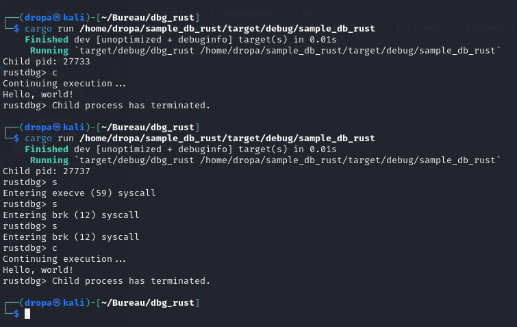
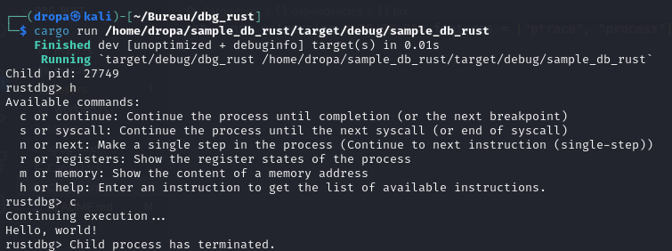
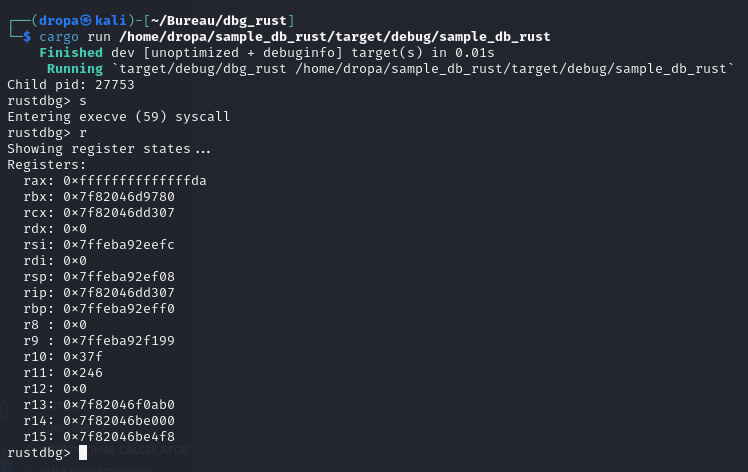
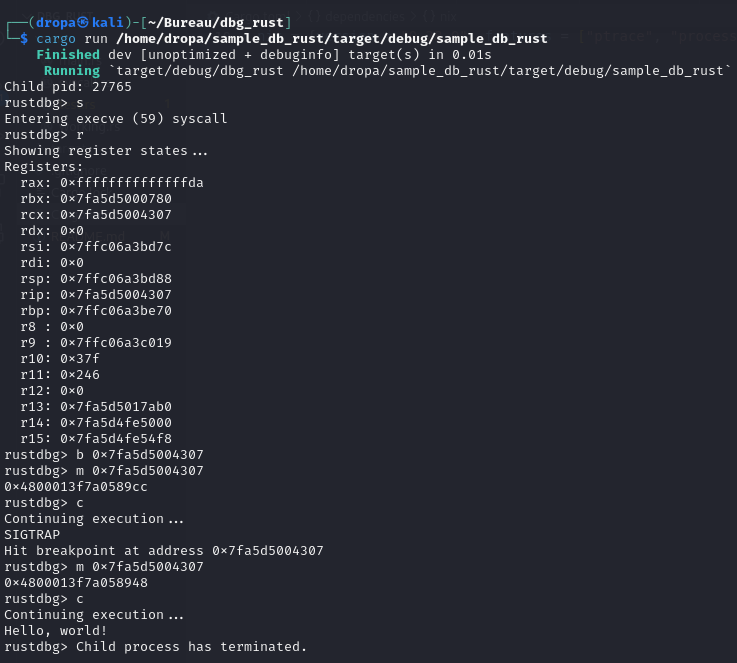

# RustDbg
This debugger is designed to trace and debug programs written in Rust. It provides basic debugging functionalities
such as stepping through code, examining register states, viewing memory contents, setting breakpoints, and more.

# Documentation

You can find the Rust Doc HTML page in target/doc/dbg_rust/index.html

## Usage

To use the debugger, simply run it with the path to the program you want to debug as a command-line argument:

```sh
cargo run <program_path>
```

Once the debugger is running, you'll be prompted with a debug console (rustdbg>). You can input various commands
to control the debugger's behavior.

## Commands

The following commands are supported:

- `c` or `continue`: Continue program execution.
- `s` or `syscall`: Step into the next system call.
- `n` or `next`: Execute the next line of code.
- `r` or `registers`: Display register states.
- `m <address>` or `memory <address>`: View the memory contents at a specified address.
- `b <address>` or `breakpoint <address>`: Set a breakpoint at a specified address.
- `h` or `help`: Display help information.
- `q` or `quit`: Exit the debugger.

## Example

```sh
$ cargo run /path/to/program
Child pid: 1234
rustdbg> c
Continuing execution...
rustdbg>
```

## Testing

Unit tests are provided to ensure the correctness of debugger functionalities. Run the tests using:

```sh
cargo test
```

## Modules

- `syscall`: Provides utilities to work with system calls.
- `working`: Contains various functions for debugger operations.

## Note

This debugger relies on the `nix` crate for system-level operations and process management.

## Safety

This debugger involves low-level operations and interacts with system resources. Care must be taken while using it
to avoid unintended consequences or system instability.

## Authors

- Ryan HENNOU
- Aurelien KRIEF


## Milestones passed

We did 5 out of the 7 milestones from <https://web.stanford.edu/class/cs110l/assignments/project-1/>

(Milestone 1 : Run the "inferior"
Milestone 2 : Stopping, resuming, and restarting the "inferior"
Milestone 3 : Printing a backtrace
Milestone 5 : Setting breakpoints  
Milestone 6 : Continuing from breakpoints)

Unfortunately, we couldn't finished all the milestones (Exam deafeated us 😔 )
But when we'll have some time, we will for sure finish this last milestone and break at main !

## Images / Proof of Work




